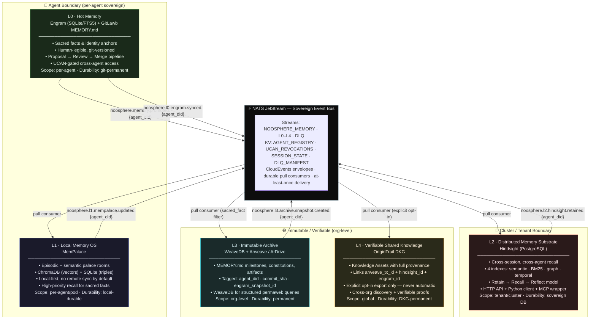

# NoosphereOS

***

NoosphereOS is a sovereign **multi-layer memory operating system for AI agents**. It gives each agent a sovereign, auditable memory stack while enabling **scoped sharing, strong RBAC, and verifiable global knowledge** across agents, clusters, and organizations — combining web2 operational control with web3 permanence and verifiable knowledge sharing.

The ratified architecture layers **Engram** (per-agent L0 hot-memory engine with GitLawb-tracked `MEMORY.md`), **MemPalace** (L1 local episodic/semantic memory OS), **Hindsight** (L2 self-hosted PostgreSQL-backed distributed memory substrate), **WeaveDB + Arweave/ArDrive** (L3 immutable permaweb archive), and **OriginTrail DKG** (L4 verifiable shared knowledge graph). All async lifecycle events flow through **NATS JetStream** as the sovereign event bus.

At its core, NoosphereOS treats **memory as moral architecture**: hot memory is human-legible and versioned; working memory is local and interpretable; long-term memory is scalable and queryable; archival memory is immutable; and shared memory is verifiable and explicitly published.

***

## Table of Contents

1. [Memory Layers](#memory-layers)
2. [NATS JetStream — Event Bus](#nats-jetstream--event-bus)
3. [Control Plane](#control-plane)
4. [Key Principles](#key-principles)
5. [Data Flow: Sacred Fact Promotion](#data-flow-sacred-fact-promotion)
6. [Roles and Permissions](#roles-and-permissions)
7. [Integration Points](#integration-points)
8. [Project Scaffolding](#project-scaffolding)
9. [Why Use NoosphereOS?](#why-use-noosphereos)

***

## Memory Layers

NoosphereOS defines five memory layers, each with a distinct scope, durability model, and sharing policy:



### L0 — Hot Memory (Engram + GitLawb `MEMORY.md`)

- One GitLawb repo **per agent** (e.g. `did:gitlawb:repo:agent-α-memory`) is the canonical hot-memory repo.
- **Engram** is the agent's internal persistent memory store — SQLite + FTS5-backed, MCP-accessible, contradiction-detecting, cross-session persistent.
- NoosphereOS generates and updates a curated **`MEMORY.md`** export from Engram: sacred facts, anchors, and core preferences in a human-readable, git-versioned form.
- Proposals to change `MEMORY.md` live in staging branches; merges into `main` are gated by NoosphereOS policy and curator/operator review.
- Cross-agent access is delegated via **UCAN capabilities** scoped to `repo/path/branch` and mediated by MCP tools (`memory_get`, `memory_propose`, `memory_review`, `memory_merge`).
- GitLawb repo events (PR opened, merged, commit created) are bridged into NATS JetStream by the Noosphere Event Bus bridge.

### L1 — Local Memory OS (MemPalace)

- Per-agent or per-pod **MemPalace** instance; local-first, no remote sync by default.
- Builds an **episodic + semantic memory palace**: rooms/wings for sacred facts, projects, conversations, and entity graphs.
- Backends: SentenceTransformers (local embeddings), ChromaDB (local vector store), SQLite (temporal triple store).
- Subscribes to NATS subjects `noosphere.memory.promoted.{agent_did}` and `noosphere.l0.engram.synced.{agent_did}` via durable pull consumers to stay current with L0 promotions and Engram observations.
- Optimized for **local-first recall, interpretability, and low latency**.

### L2 — Distributed Memory Substrate (Hindsight)

- Cluster- or tenant-wide sovereign memory substrate for **cross-session, cross-agent** recall and learning.
- PostgreSQL-backed with four indexes: semantic (vector), BM25 keyword, entity/relationship graph, and temporal.
- Core model: **retain / recall / reflect** — structured ingestion, multi-strategy hybrid retrieval, and reflective synthesis.
- Subscribes to NATS via durable pull consumers on `noosphere.memory.promoted.{agent_did}` and `noosphere.l0.engram.synced.{agent_did}`; publishes `noosphere.l2.hindsight.retained.{agent_did}` on ingest completion.
- Exposes HTTP API, Python client, and optional MCP wrapper; fully self-hostable (Docker Compose or Kubernetes).

### L3 — Immutable Archive (WeaveDB + Arweave/ArDrive)

- **Arweave/ArDrive** stores immutable snapshots and large artifacts: `MEMORY.md` milestones, SOUL.md/NOOSPHERE config versions, constitutions, PDFs, datasets, contracts.
- Asset tags include `agent_did`, `commit_sha`, `engram_snapshot_id`, `hindsight_obs_ids`, `type`, `promoted_at`.
- **WeaveDB** provides structured indexes on permaweb content for efficient agent and operator queries.
- Archive worker maintains a durable NATS pull consumer on `noosphere.memory.promoted.>` (all agents, sacred_fact policy); publishes `noosphere.l3.archive.snapshot.created.{agent_did}` on completion.

### L4 — Verifiable Shared Knowledge (OriginTrail DKG)

- Selected facts/claims with provenance are exported as **Knowledge Assets** on OriginTrail DKG.
- Sources each asset with references to `arweave_tx_id`, `hindsight_memory_id`, and `engram_snapshot_id` for full verifiable provenance.
- DKG exporter maintains a durable NATS pull consumer on `noosphere.l4.dkg.export_requested.>` — explicit opt-in only, never automatic.
- Connects NoosphereOS memory to a **decentralized knowledge graph** with cross-org discovery and verifiable proofs.

***

## NATS JetStream — Event Bus

**NATS JetStream** is the ratified event bus for NoosphereOS (ratified 2026-04-10). All asynchronous lifecycle events between memory pipeline workers — Engram sync, MemPalace updates, Hindsight ingest, archive snapshots, and DKG exports — flow through NATS JetStream.

### Why NATS JetStream

- **Single binary, no external dependencies** — deploys as a sidecar container or dedicated cluster; zero ZooKeeper, zero JVM.
- **JetStream persistence** — durable, replayable streams with at-least-once (or exactly-once) delivery; no memory events are lost even if a worker is down.
- **Subject-per-agent scoping** — the `noosphere.*.*.{agent_did}` subject hierarchy provides native per-agent event isolation with no additional routing logic.
- **Built-in KV store** — JetStream KV buckets replace the need for a separate Redis instance for agent registry, UCAN revocation, and session state.
- **CloudEvents compatible** — messages use CloudEvents envelopes (`application/cloudevents+json`), enabling A2A / MCP interop with external systems.
- **Leaf Node topology** — edge agent pods (e.g. ServerDomes / DePIN sites) connect as NATS Leaf Nodes to the central cluster; agents publish locally and the cluster replicates durably.
- **Zero-trust auth** — NKEYS + JWT-based authentication; per-subject publish/subscribe ACLs map onto agent DID namespaces; cross-agent subscriptions require an operator-issued JWT.

### Deployment Modes

| Mode | When to use |
|---|---|
| Embedded NATS (single binary) | Local dev, single-node test deployments |
| 3-node NATS cluster (JetStream replication=3) | Production sovereign multi-tenant |
| NATS Leaf Node per edge site | ServerDomes / DePIN edge deployments; leaf connects to central cluster |

### JetStream Streams

| Stream name | Subjects | Description |
|---|---|---|
| `NOOSPHERE_MEMORY` | `noosphere.memory.>` | Proposal created, promoted, reverted |
| `NOOSPHERE_L0` | `noosphere.l0.>` | Engram sync events |
| `NOOSPHERE_L1` | `noosphere.l1.>` | MemPalace update events |
| `NOOSPHERE_L2` | `noosphere.l2.>` | Hindsight retain events |
| `NOOSPHERE_L3` | `noosphere.l3.>` | Archive snapshot events |
| `NOOSPHERE_L4` | `noosphere.l4.>` | DKG export request/complete events |
| `NOOSPHERE_DLQ` | `noosphere.dlq.>` | Dead-letter stream for failed deliveries — see DLQ Strategy below |

### Subject Namespace

```text
noosphere.memory.proposal.created.{agent_did}
noosphere.memory.promoted.{agent_did}
noosphere.memory.reverted.{agent_did}
noosphere.l0.engram.synced.{agent_did}
noosphere.l1.mempalace.updated.{agent_did}
noosphere.l2.hindsight.retained.{agent_did}
noosphere.l3.archive.snapshot.created.{agent_did}
noosphere.l4.dkg.export_requested.{agent_did}

# DLQ subjects (written by NATS server on MaxDeliver exhaustion):
noosphere.dlq.{origin_stream}.{origin_subject_sanitized}
# e.g.:
noosphere.dlq.NOOSPHERE_MEMORY.noosphere.memory.promoted.did-gitlawb-agent-alpha
noosphere.dlq.NOOSPHERE_L3.noosphere.memory.promoted.did-gitlawb-agent-alpha
```

All `{agent_did}` tokens are URL-safe encoded DID strings. Workers use the `>` wildcard to subscribe across all agents within their scope (`noosphere.memory.promoted.>`).

### Built-in KV Buckets

| Bucket | Contents |
|---|---|
| `KV_AGENT_REGISTRY` | Agent DID → metadata, status, public key |
| `KV_UCAN_REVOCATIONS` | Revoked UCAN CIDs (checked on every tool call) |
| `KV_SESSION_STATE` | Transient per-agent session state |
| `KV_DLQ_MANIFEST` | DLQ entry index: `{dlq_msg_id → origin_subject, worker, attempt_count, error_class, ts_first_fail, ts_dlq, agent_did, fact_id, memory_class}` — used by the operator runbook tooling and alerting |

### Message Envelope (CloudEvents)

```json
{
  "specversion": "1.0",
  "type": "noosphere.memory.promoted",
  "source": "noosphere://control-plane",
  "id": "<uuid>",
  "time": "2026-04-10T21:00:00Z",
  "datacontenttype": "application/json",
  "data": {
    "agent_did": "did:gitlawb:agent:alpha",
    "commit": "C_main_abc123",
    "fact_id": "fact-001",
    "proposer_did": "did:gitlawb:agent:beta",
    "curator_did": "did:gitlawb:agent:gamma"
  }
}
```

### Consumer Model and Delivery Guarantees

All workers use **durable pull consumers** (work-queue semantics):

- **Delivery policy:** at-least-once; all workers MUST be idempotent on the `id` field of the CloudEvents envelope.
- **Idempotency keys:** the CloudEvents `id` (UUID) is the idempotency key. Workers record processed IDs in their local store (or a shared KV bucket) and skip re-delivery of already-processed messages.
- **Explicit ack required:** workers call `msg.ack()` only after the downstream operation (Engram write, Hindsight retain call, Arweave upload, etc.) completes and is confirmed. Partial failures must not be acked.
- **Ack wait:** default `AckWait = 30s` for standard workers; `AckWait = 300s` for archive and DKG workers which perform external network calls. Configurable per consumer in the stream JSON definition.
- **Max delivery:** `MaxDeliver = 5` across all streams. After 5 failed delivery attempts the NATS server routes the message to `NOOSPHERE_DLQ`.

---

### DLQ Strategy — Sacred Facts Must Never Vanish

The `NOOSPHERE_DLQ` stream is a **first-class operational concern**, not a discard bin. Any message that reaches the DLQ carries a sacred fact, memory promotion, or archive event that must be recovered or deliberately triaged. The following policy is mandatory for all NoosphereOS deployments.

#### NOOSPHERE_DLQ Stream Spec

```json
{
  "name": "NOOSPHERE_DLQ",
  "subjects": ["noosphere.dlq.>"],
  "retention": "limits",
  "max_age": "168h",
  "max_msgs": 50000,
  "max_msg_size": 1048576,
  "storage": "file",
  "num_replicas": 3,
  "discard": "old",
  "deny_delete": true,
  "deny_purge": true
}
```

- `max_age` is **7 days** — sufficient for any on-call rotation to triage without data loss.
- `deny_delete` and `deny_purge` are **locked**; only an operator with break-glass authority may remove DLQ messages, and every such action is logged.
- Replication=3 matches production streams; DLQ data is as durable as source event data.

#### Retry Schedule (before DLQ routing)

Each worker consumer is configured with exponential back-off on the NATS server side using `BackOff` intervals:

```
Attempt 1 (immediate):   0s   delay
Attempt 2:               15s  delay
Attempt 3:               60s  delay
Attempt 4:               300s delay  (5 min)
Attempt 5:               900s delay  (15 min)
→ MaxDeliver exhausted: route to noosphere.dlq.{stream}.{subject}
```

Workers that encounter a deterministic error (e.g., schema validation failure, revoked UCAN) may call `msg.term()` instead of `msg.nak()` to skip the retry schedule and route directly to DLQ. This prevents wasting retry budget on poison messages.

#### DLQ Message Classification

Every message that lands in `NOOSPHERE_DLQ` is classified by the DLQ consumer on arrival and written to `KV_DLQ_MANIFEST`:

| Error class | Definition | Default action |
|---|---|---|
| `transient` | Network timeout, downstream service unavailable, rate limit | Auto-retry after operator clears the downstream issue |
| `schema_error` | Malformed CloudEvents envelope, missing required field | Page operator; manual fix required before re-injection |
| `auth_error` | UCAN revoked or expired at time of processing | Re-issue UCAN or escalate; re-inject with fresh token |
| `idempotency_skip` | Message was already successfully processed (duplicate delivery) | Auto-ack and discard; write to KV_DLQ_MANIFEST for audit |
| `poison` | Worker crashed repeatedly; payload cannot be processed | Quarantine; human triage required; never auto-re-inject |
| `external_failure` | Arweave upload failed, OriginTrail DKG node unavailable, Hindsight DB down | Alert + queue for re-injection once external service recovers |

The DLQ consumer writes the classification to `KV_DLQ_MANIFEST` with the key `dlq:{dlq_msg_id}` and the full structured record:

```json
{
  "dlq_msg_id": "<nats_sequence_id>",
  "origin_stream": "NOOSPHERE_L3",
  "origin_subject": "noosphere.memory.promoted.did-gitlawb-agent-alpha",
  "worker": "archive-worker",
  "attempt_count": 5,
  "error_class": "external_failure",
  "error_detail": "ArDrive upload: 503 gateway timeout",
  "memory_class": "sacred_fact",
  "agent_did": "did:gitlawb:agent:alpha",
  "fact_id": "fact-001",
  "commit": "C_main_abc123",
  "ts_first_fail": "2026-04-10T21:00:00Z",
  "ts_dlq": "2026-04-10T21:17:00Z"
}
```

#### Sacred Fact and Constitution Escalation

Messages where `memory_class` is `sacred_fact` or `constitution` receive **immediate PagerDuty/alertmanager escalation** regardless of error class. No sacred fact may age out of the DLQ without a documented triage decision.

```yaml
# monitoring/prometheus/noosphere-rules.yml (excerpt)
- alert: DLQSacredFactUnresolved
  expr: noosphere_dlq_manifest_unresolved{memory_class=~"sacred_fact|constitution"} > 0
  for: 5m
  labels:
    severity: critical
  annotations:
    summary: "DLQ contains unresolved sacred fact or constitution event"
    description: "agent_did={{ $labels.agent_did }} fact_id={{ $labels.fact_id }} error_class={{ $labels.error_class }}"

- alert: DLQDepthWarning
  expr: nats_consumer_num_pending{stream_name="NOOSPHERE_DLQ"} > 100
  for: 15m
  labels:
    severity: warning
  annotations:
    summary: "NOOSPHERE_DLQ depth exceeds 100 unprocessed messages"

- alert: DLQMessageApproachingExpiry
  expr: noosphere_dlq_manifest_age_hours > 120
  for: 1m
  labels:
    severity: critical
  annotations:
    summary: "DLQ message approaching 7-day expiry — triage immediately"
```

#### DLQ Re-injection Flow

After the root cause is resolved, re-injection follows a strict path — **never direct stream publish**:

```text
1. Operator identifies message in KV_DLQ_MANIFEST
   → nats kv get KV_DLQ_MANIFEST dlq:{dlq_msg_id}

2. Operator or re-injection tool fetches raw message from NOOSPHERE_DLQ
   → nats consumer next NOOSPHERE_DLQ dlq-operator-consumer

3. For auth_error: re-issue UCAN, embed in message headers, then re-inject.
   For schema_error: patch payload, re-wrap in CloudEvents envelope with new `id`.
   For transient/external_failure: re-inject original message unchanged.

4. Re-inject via the dedicated re-injection subject:
   → publish to: noosphere.dlq.reinject.{origin_stream}.{agent_did}
   → The DLQ re-injection worker consumes this subject, validates the message,
     and publishes to the correct origin stream subject with a fresh sequence.

5. Ack and remove from NOOSPHERE_DLQ only after successful re-injection confirmation.

6. Update KV_DLQ_MANIFEST entry: set resolved=true, ts_resolved, operator_did.
```

The re-injection worker (`workers/dlq-reinjector/`) is the **only** component permitted to write back into source streams from a DLQ message. All re-injection is logged, attributed to the operator DID, and emits a `noosphere.dlq.reinjected.{agent_did}` audit event.

#### DLQ Worker (dlq-reinjector)

Add `workers/dlq-reinjector/` to the project scaffolding:

- Maintains a durable pull consumer on `noosphere.dlq.reinject.>`.
- Validates the incoming re-injection envelope (CloudEvents schema check, UCAN validity if present).
- Publishes to the designated origin subject with idempotency key preserved.
- Updates `KV_DLQ_MANIFEST` with resolution metadata.
- Emits `noosphere.dlq.reinjected.{agent_did}` to `NOOSPHERE_MEMORY` stream for audit trail.

#### Operator Runbook Summary

| Condition | Action |
|---|---|
| DLQ depth > 0 for `sacred_fact` / `constitution` | Page on-call immediately; check `KV_DLQ_MANIFEST`; do not wait |
| DLQ depth > 100 (any class) | Alert; review `KV_DLQ_MANIFEST` for `transient` / `external_failure` bulk re-injection |
| Message age > 5 days | Critical alert; escalate before 7-day expiry window closes |
| `poison` class message | Quarantine (do not re-inject); engage memory architecture review |
| External service recovered (Arweave, OriginTrail, Hindsight) | Run bulk re-injection for `external_failure` class; confirm `KV_DLQ_MANIFEST` all resolved |
| Break-glass DLQ purge required | Requires 2-operator approval; log to audit stream before purge; never purge without resolved entry in KV_DLQ_MANIFEST |

***

## Control Plane

The Noosphere control plane coordinates all memory operations and consists of five services:

- **Identity Service** — manages agent DIDs (`did:gitlawb:agent:...`), key generation/rotation, and DID resolution for peers, curators, and operators.
- **UCAN Capability Broker** — mints short-lived delegations (`resource / ability / expiry / audience`), validates UCAN chains on every tool invocation, and checks revocations against the `KV_UCAN_REVOCATIONS` NATS KV bucket.
- **RBAC + Policy Engine** — enforces role-based policies per agent, per group, and per memory class; sacred/constitutional facts require stricter approval.
- **Memory Router** — on reads: `L0 (MEMORY.md) → L1 → L2`; on writes: stages to Engram/L1/L2, promotes to L0 via the proposal pipeline; on milestone: triggers L3 snapshot and optional L4 export.
- **Noosphere Event Bus Bridge** — translates GitLawb webhook events into CloudEvents-enveloped NATS messages on the appropriate `noosphere.*` subjects.

***

## Key Principles

- **Per-agent sovereignty:** every agent owns its Engram store and GitLawb-backed `MEMORY.md` repository, with a complete signed history.
- **Human-legible hot memory:** sacred facts, long-lived preferences, and identity-critical details are curated into `MEMORY.md` for direct inspection and bootstrap context.
- **Promotion, not dumping:** raw interactions flow into Engram, MemPalace, and Hindsight first; only promoted facts are written to `MEMORY.md` via proposal/review/merge.
- **Capability-based access:** cross-agent memory access is delegated via UCANs on precise resources, never via broad shared credentials.
- **Event-driven propagation:** all layer-to-layer updates are triggered by durable NATS JetStream events, not polling or synchronous calls. Workers are independently deployable and horizontally scalable.
- **Layered sharing:**
  - L0/L1 (Engram + `MEMORY.md` + MemPalace) are **agent-local**.
  - L2 (Hindsight) is **tenant/cluster-wide**.
  - L3 (WeaveDB + Arweave/ArDrive) is **immutable org-level history**.
  - L4 (OriginTrail DKG) is **globally verifiable knowledge**, explicitly exported.
- **Rollback and auditability:** any sacred fact traces to an Engram record, a git commit, proposer/curator DIDs, a Hindsight observation, and a permaweb snapshot. Bad merges are reverted via `noosphere.memory.reverted.{agent_did}` events which propagate automatically to Engram, MemPalace, and Hindsight.
- **DLQ as sacred ground:** no message in `NOOSPHERE_DLQ` may expire without a documented triage decision. Sacred facts and constitutions in the DLQ trigger immediate escalation.

***

## Data Flow: Sacred Fact Promotion

Example operation: **Agent β proposes a new sacred fact for Agent α**.

```mermaid
sequenceDiagram
    autonumber
    actor Beta as Agent β (Proposer)
    actor Gamma as Agent γ (Curator)
    participant CP as Control Plane<br/>(RBAC + UCAN Broker)
    participant GL as GitLawb<br/>(MEMORY.md repo)
    participant NATS as NATS JetStream<br/>NOOSPHERE_MEMORY stream
    participant E as Engram Sync Worker<br/>(L0)
    participant MP as MemPalace Worker<br/>(L1)
    participant HS as Hindsight Ingest Worker<br/>(L2)
    participant ARC as Archive Worker<br/>(L3)
    participant DKG as DKG Exporter<br/>(L4)
    participant DLQ as NOOSPHERE_DLQ<br/>+ KV_DLQ_MANIFEST

    rect rgb(20, 40, 20)
        Note over Beta,GL: Phase 1 — Proposal (L0 Governance)
        Beta->>CP: memory_propose(fact, target=α)
        CP->>CP: RBAC check (β has contributor rights for α)
        CP->>CP: UCAN mint (repo/file/propose, staging, 10min TTL)
        CP->>GL: create staging branch, patch MEMORY.md, open PR
        GL-->>NATS: memory.proposal.created.{α-did}
    end

    rect rgb(20, 20, 40)
        Note over Gamma,NATS: Phase 2 — Review and Merge (L0 Governance)
        Gamma->>CP: memory_review → memory_merge (UCAN: repo/pr/merge)
        CP->>GL: merge staging → main (commit C_main)
        GL-->>NATS: memory.promoted.{α-did}<br/>{commit: C_main, fact_id, proposer: β, curator: γ}
    end

    rect rgb(40, 20, 20)
        Note over NATS,HS: Phase 3 — Parallel Async Propagation (L0 / L1 / L2)
        par Engram Sync
            NATS-->>E: pull consumer · memory.promoted.{α-did}
            E->>E: write sacred_fact record + resolve contradictions
            E-->>NATS: l0.engram.synced.{α-did}
        and MemPalace Update
            NATS-->>MP: pull consumer · memory.promoted.{α-did}
            MP->>MP: re-parse MEMORY.md@C_main, update palace room,<br/>insert triples, set high-priority recall flag
            MP-->>NATS: l1.mempalace.updated.{α-did}
        and Hindsight Ingest
            NATS-->>HS: pull consumer · memory.promoted + engram.synced
            HS->>HS: retain(content, entities, relationships,<br/>source, engram_id, provenance)
            HS-->>NATS: l2.hindsight.retained.{α-did}
        end
    end

    rect rgb(20, 35, 40)
        Note over NATS,ARC: Phase 4 — Archival Snapshot (L3)
        NATS-->>ARC: pull consumer · memory.promoted (sacred_fact filter)
        ARC->>ARC: push MEMORY.md@C_main → Arweave/ArDrive<br/>write WeaveDB index row
        ARC-->>NATS: l3.archive.snapshot.created.{α-did}
    end

    rect rgb(40, 35, 20)
        Note over NATS,DKG: Phase 5 — DKG Export (L4, explicit opt-in)
        NATS-->>DKG: pull consumer · l4.dkg.export_requested (opt-in only)
        DKG->>DKG: publish Knowledge Asset<br/>(arweave_tx_id + hindsight_id + engram_id)
    end

    rect rgb(60, 20, 20)
        Note over NATS,DLQ: Failure Path — Any Phase
        NATS--xDLQ: MaxDeliver exhausted (5 attempts + backoff)<br/>→ route to noosphere.dlq.{stream}.{subject}
        DLQ->>DLQ: classify error_class, write KV_DLQ_MANIFEST
        DLQ-->>DLQ: sacred_fact / constitution → immediate PagerDuty alert<br/>deny_delete=true · deny_purge=true · 7-day retention · replicas=3
        Note over DLQ: Fact preserved in all layers that succeeded.<br/>Pipeline incomplete until DLQ resolved via dlq-reinjector.
    end
```



1. **Proposal (Engram + GitLawb staging)**
   - β writes the candidate fact into its own Engram store and calls `memory_propose` on the Noosphere Memory MCP server.
   - RBAC verifies β has `contributor` rights for α; UCAN broker mints a scoped delegation (`repo/file/propose`, staging branch only, 10-minute expiry).
   - GitLawb creates the staging branch, patches `MEMORY.md`, and opens a PR annotated with proposer DID, UCAN CID, and `fact_id`.
   - NATS publishes: `noosphere.memory.proposal.created.{α-did}` (CloudEvents envelope).

2. **Review and merge (L0 governance)**
   - Curator γ (or human operator) receives the NATS event, calls `memory_diff`, and reviews the proposed change.
   - On approval: `memory_review` then `memory_merge`; UCAN enforces `repo/pr/review` and `repo/pr/merge` on the specific PR.
   - GitLawb merges to `main`, creating commit `C_main`.
   - NATS publishes: `noosphere.memory.promoted.{α-did}` with `{commit: C_main, fact_id, proposer: β, curator: γ}`.

3. **Parallel async propagation (L0/L1/L2)**

   Three durable pull consumers fire simultaneously:

   - **Engram sync worker** (stream `NOOSPHERE_MEMORY`): writes a structured `sacred_fact` record into α's Engram store with full provenance; resolves contradictions; publishes `noosphere.l0.engram.synced.{α-did}`.
   - **MemPalace** (stream `NOOSPHERE_MEMORY`): re-parses `MEMORY.md` at `C_main`, updates the "Sacred Facts" palace room, inserts new triples, sets high-priority recall flag; publishes `noosphere.l1.mempalace.updated.{α-did}`.
   - **Hindsight ingest worker** (streams `NOOSPHERE_MEMORY` + `NOOSPHERE_L0`): builds a structured memory `{content, entities, relationships, source, engram_id, provenance}`; calls Hindsight retain API; indexes across semantic, BM25, graph, and temporal indexes; publishes `noosphere.l2.hindsight.retained.{α-did}`.

4. **Archival snapshot (L3)**
   - Archive worker (stream `NOOSPHERE_MEMORY`, filter `sacred_fact=true`): pushes `MEMORY.md` at `C_main` to Arweave/ArDrive; writes WeaveDB index row with `arweave_tx_id`, `engram_snapshot_id`, `hindsight_memory_ids`; publishes `noosphere.l3.archive.snapshot.created.{α-did}`.

5. **DKG export (L4, explicit opt-in)**
   - DKG exporter (stream `NOOSPHERE_L4`, subject `dkg.export_requested`): publishes Knowledge Asset on OriginTrail DKG linking Arweave + Hindsight + Engram IDs with access policy (public / org-permissioned / group).

> **Failure at any step:** if a worker exhausts its retry schedule, the message is routed to `NOOSPHERE_DLQ`. For sacred fact promotions, this triggers an immediate `DLQSacredFactUnresolved` alert. The fact remains in the source layer(s) that successfully processed it; no data is lost, but the pipeline is incomplete until the DLQ is resolved. See [DLQ Strategy](#dlq-strategy--sacred-facts-must-never-vanish).

***

## Roles and Permissions

NoosphereOS uses **RBAC + UCAN** for least-privilege enforcement:

| Role | Key capabilities |
|---|---|
| **Owner agent** | Full rights over own memory repo; can delegate to peers |
| **Peer reader** | Read-only `MEMORY.md`; no write or propose rights |
| **Contributor agent** | Propose changes (staging branches/PRs); cannot merge |
| **Curator agent** | Review and merge PRs according to policy |
| **Human operator** | Break-glass authority; override for critical changes |

All MCP access is authenticated via OAuth 2.1; every tool call is validated against RBAC + UCAN (including revocation check against `KV_UCAN_REVOCATIONS`) before any GitLawb or storage operation.

***

## Integration Points

- **MCP-based agents** (OpenClaw, moltbot, custom MCP clients) call Noosphere's Memory MCP server for `memory_get / propose / review / merge / subscribe` instead of talking directly to any backing store.
- **GitLawb** provides DID + UCAN-native repo/file/PR operations; canonical backend for per-agent `MEMORY.md` governance and signed history.
- **Engram** runs per agent as the internal hot-memory engine (SQLite/FTS5); accessed by local runtimes or via its own MCP server.
- **MemPalace** sits as a local sidecar with MCP server; provides high-quality local episodic/semantic recall incorporating `MEMORY.md` anchors and Engram sync records.
- **Hindsight** reachable via HTTP or Python client (MCP wrapper optional); cluster-level L2 substrate for structured retain/recall/reflect.
- **NATS JetStream** is the event bus: all workers subscribe to durable pull consumers; the GitLawb webhook bridge publishes into the `noosphere.*` subject namespace; KV buckets provide agent registry, UCAN revocation ledger, session state, and the DLQ manifest index.
- **Arweave/ArDrive + WeaveDB** provide permaweb permanence and queryable indexes for L3 archival snapshots.
- **OriginTrail DKG** provides verifiable cross-org knowledge sharing at L4 via explicit export.

***

## Project Scaffolding

The following is the canonical NoosphereOS directory and file structure. Each top-level directory corresponds to a deployable service, library, or configuration concern.

```text
NoosphereOS/
│
├── README.md                          # This file
├── ARCHITECTURE_DIAGRAM.md            # Full ASCII architecture diagrams
├── CONTRIBUTING.md                    # Contribution guidelines
├── LICENSE
│
├── docs/                              # Narrative documentation
│   ├── principles.md                  # Memory-as-moral-architecture rationale
│   ├── ucan-model.md                  # UCAN capability model and attenuation rules
│   ├── rbac-policy.md                 # Role definitions and policy matrix
│   ├── nats-event-bus.md              # NATS JetStream setup, streams, subjects
│   ├── dlq-strategy.md                # DLQ classification, retry schedule, runbook
│   ├── hindsight-integration.md       # Hindsight retain/recall/reflect guide
│   └── deployment-guide.md            # Docker Compose and Kubernetes deployment
│
├── control-plane/                     # Noosphere control plane services
│   ├── identity/                      # Agent DID management service
│   │   ├── src/
│   │   ├── Dockerfile
│   │   └── README.md
│   ├── ucan-broker/                   # UCAN capability minting and validation
│   │   ├── src/
│   │   ├── Dockerfile
│   │   └── README.md
│   ├── rbac-engine/                   # RBAC + policy evaluation service
│   │   ├── src/
│   │   ├── Dockerfile
│   │   └── README.md
│   ├── memory-router/                 # Read/write routing across L0–L4
│   │   ├── src/
│   │   ├── Dockerfile
│   │   └── README.md
│   └── event-bus-bridge/              # GitLawb webhook → NATS JetStream bridge
│       ├── src/
│       ├── Dockerfile
│       └── README.md
│
├── mcp-server/                        # Noosphere Memory MCP server
│   ├── src/
│   │   ├── tools/                     # memory_get, propose, review, merge, subscribe
│   │   ├── auth/                      # OAuth 2.1 + UCAN + RBAC middleware
│   │   └── main.ts
│   ├── Dockerfile
│   └── README.md
│
├── event-bus/                         # NATS JetStream configuration and tooling
│   ├── nats-server.conf               # NATS server config (JetStream, TLS, auth)
│   ├── streams/                       # Stream definitions (JSON/YAML)
│   │   ├── NOOSPHERE_MEMORY.json
│   │   ├── NOOSPHERE_L0.json
│   │   ├── NOOSPHERE_L1.json
│   │   ├── NOOSPHERE_L2.json
│   │   ├── NOOSPHERE_L3.json
│   │   ├── NOOSPHERE_L4.json
│   │   └── NOOSPHERE_DLQ.json         # deny_delete=true, deny_purge=true, max_age=168h
│   ├── kv-buckets/                    # KV bucket provisioning scripts
│   │   ├── KV_AGENT_REGISTRY.sh
│   │   ├── KV_UCAN_REVOCATIONS.sh
│   │   ├── KV_SESSION_STATE.sh
│   │   └── KV_DLQ_MANIFEST.sh         # DLQ entry index for operator tooling and alerts
│   ├── accounts/                      # NKEYS + JWT account configs (per agent DID)
│   └── docker-compose.nats.yml        # Standalone NATS cluster compose file
│
├── workers/                           # Async pipeline workers (NATS consumers)
│   ├── engram-sync/                   # L0: memory_promoted → Engram store update
│   │   ├── src/
│   │   ├── Dockerfile
│   │   └── README.md
│   ├── mempalace-sync/                # L1: memory_promoted → MemPalace palace update
│   │   ├── src/
│   │   ├── Dockerfile
│   │   └── README.md
│   ├── hindsight-ingest/              # L2: memory_promoted + engram_synced → Hindsight retain
│   │   ├── src/
│   │   ├── Dockerfile
│   │   └── README.md
│   ├── archive-worker/                # L3: memory_promoted (sacred) → Arweave + WeaveDB
│   │   ├── src/
│   │   ├── Dockerfile
│   │   └── README.md
│   ├── dkg-exporter/                  # L4: dkg_export_requested → OriginTrail DKG
│   │   ├── src/
│   │   ├── Dockerfile
│   │   └── README.md
│   └── dlq-reinjector/                # DLQ: operator-triggered re-injection back to origin streams
│       ├── src/
│       │   ├── main.py                # Pull consumer on noosphere.dlq.reinject.>
│       │   ├── classifier.py          # Error class detection; writes KV_DLQ_MANIFEST
│       │   └── reinjector.py          # Validates, re-publishes to origin stream, updates manifest
│       ├── Dockerfile
│       └── README.md
│
├── l0-hot-memory/                     # L0 tooling and config
│   ├── engram/                        # Engram service config and local dev setup
│   │   └── docker-compose.engram.yml
│   └── gitlawb/                       # GitLawb repo templates and webhook config
│       ├── memory-repo-template/
│       │   ├── MEMORY.md.template
│       │   └── .noosphere/
│       │       └── policy.yml         # Per-repo RBAC + UCAN policy
│       └── webhook-bridge.yml         # GitLawb webhook → event-bus-bridge config
│
├── l1-mempalace/                      # L1 MemPalace service config
│   ├── config/
│   │   ├── palace-structure.yml       # Room/wing definitions
│   │   └── retrieval-policy.yml       # Recall strategies, token budget
│   └── docker-compose.mempalace.yml
│
├── l2-hindsight/                      # L2 Hindsight service config
│   ├── config/
│   │   ├── hindsight.yml              # Retention, recall, reflect config
│   │   └── postgres.yml               # PostgreSQL connection and schema config
│   └── docker-compose.hindsight.yml
│
├── l3-archive/                        # L3 archive config
│   ├── config/
│   │   ├── arweave.yml                # ArDrive wallet and gateway config
│   │   └── weavedb.yml                # WeaveDB contract and schema config
│   └── archive-policy.yml             # Which memory types trigger L3 snapshots
│
├── l4-dkg/                            # L4 OriginTrail DKG config
│   ├── config/
│   │   ├── origintrail.yml            # DKG node, wallet, and network config
│   │   └── export-policy.yml          # Opt-in export rules and access levels
│   └── knowledge-asset-schema.json    # JSON-LD / Knowledge Asset schema
│
├── sdk/                               # NoosphereOS client SDK
│   ├── python/                        # Python client (agents, workers)
│   │   ├── noosphere/
│   │   │   ├── client.py              # MCP tool wrappers
│   │   │   ├── events.py              # NATS publish/subscribe helpers
│   │   │   ├── dlq.py                 # KV_DLQ_MANIFEST read/write helpers; re-injection client
│   │   │   ├── ucan.py                # UCAN minting and validation
│   │   │   └── models.py              # Pydantic models for events and memory types
│   │   └── pyproject.toml
│   └── typescript/                    # TypeScript client (MCP agents)
│       ├── src/
│       │   ├── client.ts
│       │   ├── events.ts
│       │   ├── dlq.ts                 # KV_DLQ_MANIFEST helpers; re-injection client
│       │   └── ucan.ts
│       └── package.json
│
├── deploy/                            # Deployment manifests
│   ├── docker-compose.yml             # Full local stack (all services)
│   ├── kubernetes/                    # Kubernetes manifests
│   │   ├── namespace.yaml
│   │   ├── nats/                      # NATS cluster StatefulSet + services
│   │   ├── control-plane/             # Identity, UCAN, RBAC, router deployments
│   │   ├── mcp-server/
│   │   ├── workers/
│   │   ├── l2-hindsight/
│   │   └── monitoring/                # Prometheus + Grafana configs
│   └── leaf-node/                     # NATS Leaf Node config for edge/DePIN sites
│       ├── nats-leaf.conf
│       └── docker-compose.leaf.yml
│
├── monitoring/                        # Observability
│   ├── prometheus/
│   │   └── noosphere-rules.yml        # Alert rules: DLQSacredFactUnresolved (critical),
│   │                                  #   DLQDepthWarning, DLQMessageApproachingExpiry,
│   │                                  #   memory pipeline SLOs
│   ├── grafana/
│   │   └── dashboards/
│   │       ├── nats-jetstream.json    # NATS stream lag, consumer health, DLQ depth
│   │       ├── memory-pipeline.json   # Promotion latency, L0→L4 event rates
│   │       ├── dlq-manifest.json      # DLQ depth by error class, age, memory class
│   │       └── hindsight-l2.json      # Retain/recall/reflect metrics
│   └── loki/
│       └── noosphere-log-pipeline.yml
│
└── tests/
    ├── integration/                   # End-to-end memory promotion flow tests
    │   ├── test_sacred_fact_promotion.py
    │   ├── test_rollback_flow.py
    │   ├── test_nats_consumers.py
    │   └── test_dlq_reinjection.py    # DLQ routing, classification, and re-injection flow
    ├── unit/
    │   ├── test_ucan_broker.py
    │   ├── test_rbac_engine.py
    │   ├── test_cloudevents_envelope.py
    │   └── test_dlq_classifier.py     # Error class detection unit tests
    └── fixtures/
        ├── agent-alpha/
        │   ├── MEMORY.md
        │   └── engram-snapshot.json
        └── events/
            ├── memory_promoted.json
            ├── memory_reverted.json
            └── dlq_entry.json         # Example KV_DLQ_MANIFEST entry fixture
```

### Key file notes

- **`event-bus/nats-server.conf`** — primary NATS server config; defines JetStream storage directory, TLS certs, NKEYS resolver, and per-account subject ACLs. Start here when setting up a new deployment.
- **`event-bus/streams/NOOSPHERE_DLQ.json`** — `deny_delete=true`, `deny_purge=true`, `max_age=168h`, `num_replicas=3`. This stream is immutable by default; operator break-glass removal requires 2-operator approval and audit log entry.
- **`event-bus/kv-buckets/KV_DLQ_MANIFEST.sh`** — provisions the DLQ manifest KV bucket; used by the DLQ classifier, re-injection worker, alerting rules, and operator tooling.
- **`event-bus/streams/*.json`** — one file per JetStream stream; defines subjects, retention policy, max age, replication factor, and storage backend. Applied via `nats stream add --config`.
- **`workers/dlq-reinjector/`** — the only component permitted to write messages back into source streams from the DLQ. Consumes `noosphere.dlq.reinject.>`, validates, re-publishes to origin subject, updates `KV_DLQ_MANIFEST`, and emits `noosphere.dlq.reinjected.{agent_did}` for audit.
- **`workers/*/src/`** — each worker is a standalone process with a durable pull consumer, explicit ack after confirmed downstream write, idempotency check on CloudEvents `id`, and `msg.term()` on deterministic errors to skip retry budget.
- **`control-plane/event-bus-bridge/`** — the GitLawb webhook bridge; entry point for all L0 events into the NATS pipeline.
- **`deploy/docker-compose.yml`** — full local dev stack including the `dlq-reinjector` worker and all monitoring services.
- **`deploy/leaf-node/`** — NATS Leaf Node configuration for edge/DePIN deployments.
- **`sdk/python/noosphere/dlq.py`** — helpers for reading `KV_DLQ_MANIFEST`, triggering re-injection via `noosphere.dlq.reinject.*`, and querying DLQ depth by error class or memory class.
- **`monitoring/grafana/dashboards/dlq-manifest.json`** — Grafana dashboard showing DLQ depth by error class, memory class, and age; critical panel for `sacred_fact` / `constitution` unresolved entries.

***

## Why Use NoosphereOS?

- You want **per-agent, inspectable memory** rather than opaque embedding stores.
- You need a **multi-agent memory fabric** with granular permissions: some agents may read, a few may propose, only curators may merge.
- You value **immutable, permaweb-backed archives** of constitutions, identity, and high-impact decisions.
- You want to **share some knowledge globally**, with verifiable provenance, while keeping most memory local and private.
- You need **horizontally scalable, event-driven propagation** across the full memory pipeline — Engram, MemPalace, Hindsight, archive, and DKG — without polling or tight coupling between services.
- You operate **edge or distributed infrastructure** (e.g. DePIN, multi-site data centers) where a NATS Leaf Node topology lets each site publish locally while maintaining a sovereign central memory cluster.
- You need a **guaranteed delivery guarantee for sacred facts**: the DLQ strategy ensures no memory promotion event expires silently — every failure is classified, tracked in `KV_DLQ_MANIFEST`, alerted on, and recoverable via the re-injection pipeline.

***

*Architecture ratified April 2026. Sovereign stack: **Engram + GitLawb MEMORY.md (L0)** · **MemPalace (L1)** · **Hindsight (L2)** · **WeaveDB + Arweave/ArDrive (L3)** · **OriginTrail DKG (L4)** · **NATS JetStream (Event Bus)**.*
